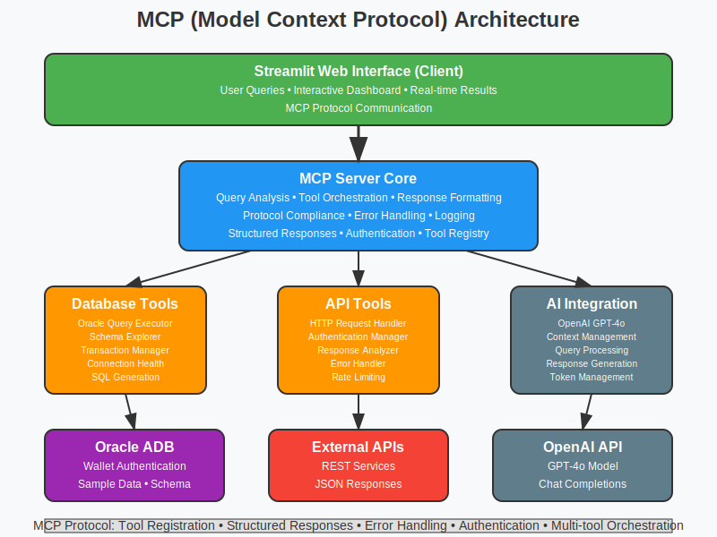

# LangChain Agent with Oracle ADB & MCP Integration

## Overview

This application is an enterprise-grade LLM gateway that demonstrates the Model Context Protocol (MCP) integration with Oracle Autonomous Database (ADB) connection patterns. It provides a sophisticated AI agent capable of executing database operations, making API calls, and providing intelligent responses through a modern web interface.



## What This Application Does

### Core Capabilities

1. **Intelligent Database Operations**
   - Execute SQL queries against Oracle ADB patterns
   - Explore database schema and table structures
   - Manage transactions with ACID compliance
   - View real-time query execution results

2. **External API Integration**
   - Make HTTP requests to external services
   - Handle various authentication methods
   - Process JSON and XML responses
   - Monitor API call performance

3. **AI-Powered Assistance**
   - Natural language query processing via OpenAI GPT-4o
   - Context-aware responses about database operations
   - Intelligent tool selection and execution
   - Conversation memory and history tracking

4. **Enterprise Features**
   - Structured logging with rotation
   - Configuration management
   - Tool execution monitoring
   - Error handling and recovery

## Architecture Components

### User Interface Layer
- **Streamlit Web Application**: Interactive chat interface for user interactions
- **Configuration Panel**: Real-time system status and settings
- **Tool Execution History**: Visual tracking of all tool executions
- **Database Schema Viewer**: Live schema exploration interface

### MCP Server Layer
- **Working MCP Server**: Orchestrates query processing and tool execution
- **OpenAI Integration**: GPT-4o client for intelligent response generation
- **Tool Manager**: Controls and monitors tool execution flow

### Tools & Integrations
- **Oracle Query Executor**: Executes SQL queries with Oracle ADB formatting
- **Schema Explorer**: Discovers and analyzes database metadata
- **Transaction Manager**: Handles database transactions with proper isolation
- **API Caller**: Makes external HTTP requests with authentication
- **HTTP Request Tool**: Advanced HTTP operations with detailed analysis

### Data Layer
- **Oracle ADB Simulation**: SQLite backend implementing Oracle patterns
- **Enterprise Sample Data**: Realistic datasets (employees, departments, orders, products)
- **External API Endpoints**: Integration with REST services
- **Configuration Storage**: Environment-based settings management

## How to Use

### Prerequisites

1. **OpenAI API Key**: Required for AI functionality
   - Sign up at [OpenAI Platform](https://platform.openai.com/)
   - Create an API key in your dashboard
   - Add it to your environment as `OPENAI_API_KEY`

2. **Python Environment**: Python 3.11+ recommended

### Installation & Setup

1. **Clone and Navigate**
   ```bash
   git clone <repository-url>
   cd langchain-oracle-mcp
   ```

2. **Install Dependencies**
   ```bash
   pip install -r requirements.txt
   ```

3. **Set Environment Variables**
   ```bash
   export OPENAI_API_KEY="your-openai-api-key-here"
   ```

4. **Run the Application**
   ```bash
   streamlit run app.py --server.port 5000
   ```

5. **Access the Interface**
   - Open your browser to `http://localhost:5000`
   - The application will initialize automatically

### Using the Interface

#### Main Chat Interface
- **Ask Questions**: Type natural language queries about your database
- **View Responses**: Get intelligent AI responses with tool execution details
- **Monitor Tools**: See real-time tool execution in expandable sections

#### Example Queries

**Database Operations:**
```
"Show me all employees in the IT department"
"What tables are available in the database?"
"Get the latest orders from this month"
"Describe the schema of the employees table"
```

**API Operations:**
```
"Make an API call to get sample data"
"Test the external service endpoint"
"Show me how to make HTTP requests"
```

**Mixed Operations:**
```
"Query the database and then call an external API"
"Get employee data and format it for an API call"
```

#### Sidebar Features
- **Connection Status**: Monitor OpenAI and database connectivity
- **Available Tools**: View all enabled tools and their status
- **Clear Conversation**: Reset chat history and tool executions

#### Tool Execution History
- **Recent Executions**: View the last 10 tool executions
- **Detailed Results**: Expand to see input parameters and output data
- **Performance Metrics**: Monitor execution times and success rates
- **Data Visualization**: Automatic table formatting for query results

#### Database Schema Viewer
- **Live Schema**: Real-time database structure information
- **Table Details**: Column definitions, constraints, and relationships
- **Metadata**: Oracle-style system information and statistics

## What This Application Serves

### Enterprise Use Cases

1. **Database Administration**
   - Query execution and optimization
   - Schema exploration and analysis
   - Transaction management and monitoring
   - Performance tuning assistance

2. **API Integration Testing**
   - External service connectivity testing
   - Authentication method validation
   - Response format analysis
   - Integration debugging

3. **AI-Assisted Development**
   - Natural language to SQL translation
   - Code generation and optimization
   - Documentation and explanation
   - Best practices recommendations

4. **Data Analysis & Reporting**
   - Ad-hoc query execution
   - Data exploration and discovery
   - Report generation assistance
   - Business intelligence support

### Technical Benefits

1. **Oracle ADB Patterns**
   - Demonstrates real Oracle connection patterns
   - Implements enterprise-grade transaction handling
   - Provides Oracle-compatible SQL formatting
   - Shows proper error handling and recovery

2. **MCP Integration**
   - Showcases Model Context Protocol implementation
   - Demonstrates tool orchestration patterns
   - Provides extensible architecture for new tools
   - Shows proper AI agent design patterns

3. **Production-Ready Features**
   - Comprehensive logging and monitoring
   - Environment-based configuration
   - Error handling and graceful degradation
   - Security best practices

## Configuration

### Environment Variables

```bash
# Required
OPENAI_API_KEY=your-openai-api-key

# Optional Database Configuration
DB_PATH=./data/enterprise_db.sqlite
ORACLE_HOST=autonomous-db.oracle.com
ORACLE_SERVICE=autonomous_db_high

# Optional API Configuration
API_MAX_RETRIES=3
API_TIMEOUT=30
API_RATE_LIMIT=100

# Optional Logging Configuration
LOG_LEVEL=INFO
LOG_FILE=./logs/mcp_server.log
LOG_CONSOLE=true
```

### Customization Options

1. **Add New Tools**: Extend the tool set by implementing new BaseTool classes
2. **Database Schema**: Modify the sample data in `database.py`
3. **UI Customization**: Adjust the Streamlit interface in `app.py`
4. **Logging Configuration**: Customize logging behavior in `logger.py`

## Technical Architecture

### Design Patterns

- **Model Context Protocol (MCP)**: Standardized tool integration
- **Tool Orchestration**: Intelligent tool selection and execution
- **Enterprise Database Patterns**: Oracle ADB connection simulation
- **Microservices Architecture**: Modular, scalable component design

### Key Technologies

- **Frontend**: Streamlit (Python web framework)
- **AI Integration**: OpenAI GPT-4o API
- **Database**: SQLite with Oracle pattern simulation
- **HTTP Client**: Requests with advanced authentication
- **Logging**: Structured logging with rotation
- **Configuration**: Environment-based settings

### Performance Features

- **Connection Pooling**: Efficient database connection management
- **Caching**: Streamlit resource caching for optimal performance
- **Async Operations**: Non-blocking tool execution
- **Error Recovery**: Graceful handling of failures

## Troubleshooting

### Common Issues

1. **OpenAI API Connection Fails**
   - Verify your API key is correctly set
   - Check your OpenAI account has sufficient credits
   - Ensure network connectivity to OpenAI services

2. **Database Connection Issues**
   - Check database file permissions
   - Verify SQLite installation
   - Review log files for detailed error messages

3. **Tool Execution Failures**
   - Monitor the tool execution history panel
   - Check individual tool error messages
   - Verify external API endpoints are accessible

### Getting Help

- Review the application logs in `./logs/mcp_server.log`
- Check the Streamlit console output
- Examine tool execution details in the web interface
- Verify environment variable configuration

## License

This project demonstrates enterprise patterns and is intended for educational and development purposes. Please ensure compliance with Oracle licensing terms when using with actual Oracle databases.